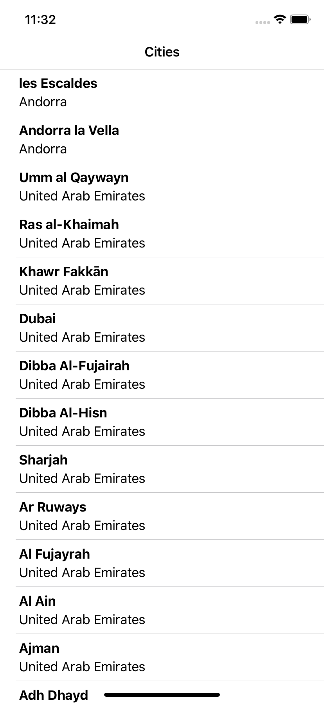
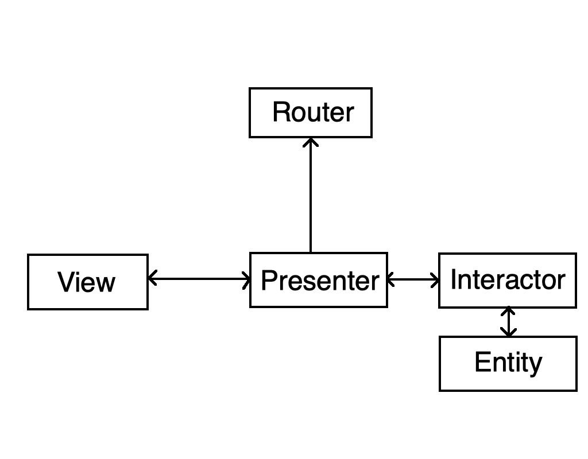

# SwiftVIPERCitiesDemo

# World Cities JSON
world-cities.json file has been taken from https://datahub.io/core/world-cities#data

# VIPER CITIES DEMO
An example cities list app written in Swift using VIPER architecture.

# View - 
  Responsibility of view is to send user actions to the presenter and show whatever the presenter asks it to.
# Interactor - 
  It has the business logic for the app specified by a use case.
# Presenter - 
  Contains the view logic for preparing content for display and for reacting to user interactions.
# Entity - 
  The basic model for objects used by interaction.
# Router - 
  Contains logic for routing of screens.

# Run Demo

1. git clone https://github.com/ineelam899/SwiftVIPERCitiesDemo.git
2. cd SwiftVIPERCitiesDemo
3. pod install
4. Open SwiftVIPERCitiesDemo.xcworkspace in Xcode.
5. Run

# Author
Neelam Shehzadi

# License
SwiftVIPERCitiesDemo is available under the MIT license. See the LICENSE file for more info.
